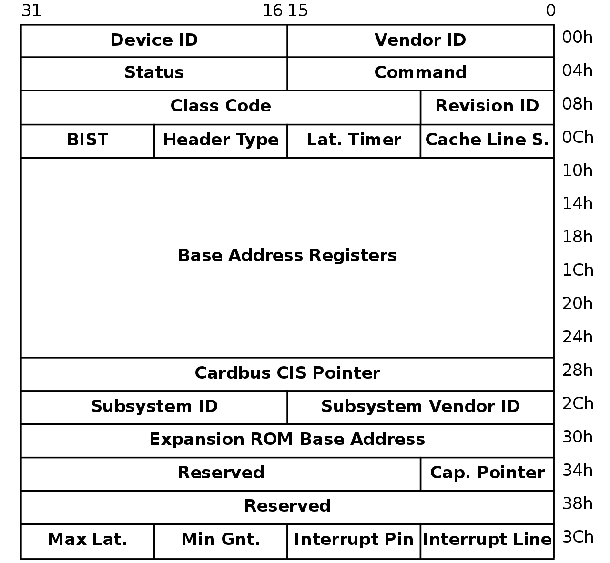

# Reading IOMMU Regsiters in Linux
List Devices
```shell
root@maslab-pc05:/home/z99gao# lspci | grep IOMMU
00:00.2 IOMMU: Advanced Micro Devices, Inc. [AMD] Starship/Matisse IOMMU
20:00.2 IOMMU: Advanced Micro Devices, Inc. [AMD] Starship/Matisse IOMMU
40:00.2 IOMMU: Advanced Micro Devices, Inc. [AMD] Starship/Matisse IOMMU
60:00.2 IOMMU: Advanced Micro Devices, Inc. [AMD] Starship/Matisse IOMMU
```
Read Registers
```shell
root@maslab-pc05:/home/z99gao# lspci -x -s 00:00.2
00:00.2 IOMMU: Advanced Micro Devices, Inc. [AMD] Starship/Matisse IOMMU
00: 22 10 81 14 40 00 10 00 00 00 06 08 00 00 80 00
10: 00 00 00 00 00 00 00 00 00 00 00 00 00 00 00 00
20: 00 00 00 00 00 00 00 00 00 00 00 00 aa 17 46 10
30: 00 00 00 00 40 00 00 00 00 00 00 00 ff 00 00 00
```
Register Format

